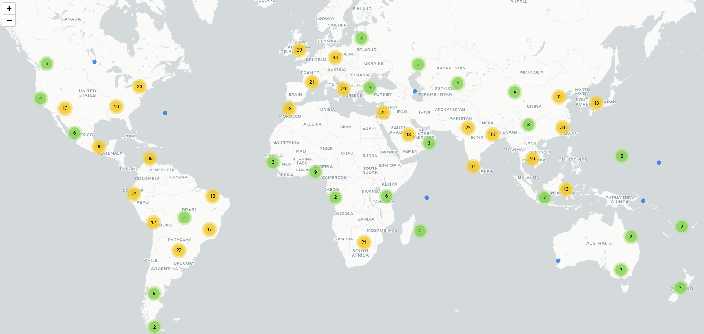

# PP_lounge 🌍✨

Priority Pass Lounge Global Interactive Map 🗺️✈️

## Why this project? 🤔

Many Priority Pass members get access through credit card benefits 💳, and those plans often focus on lounge access 🛋️ rather than other airport experiences.

The official Priority Pass website can be inconvenient if your main goal is to quickly find actual lounges:

1. 🌐 There is no clear global map view.  
   You usually need to search airports (type in airport names) 🔎, then open each page to check lounge availability.
2. 🍽️ The official listings also include non-lounge experiences (for example, dining or relaxation services), which can make lounge-only planning less efficient.
3. 🧭 Route planning is harder when you want to compare lounge availability across regions at a glance.

This project solves that by scanning Priority Pass lounge coverage worldwide 🌎 and showing lounge-enabled airports on one interactive global map 🧩.

## Live Interactive Map 🚀

- 🌍 **Live Demo (GitHub Pages):**  
  👉 [Open the interactive map](https://ld3156.github.io/PP_lounge/priority_pass_lounges_map_v1_Feb26.html)

## Preview 👀


**Disclaimer:**
Created by Li Dai (February 2026). This project is not affiliated with Priority Pass.  Data is collected from public sources and may be incomplete, outdated, or inaccurate.

## Data Sources 📚

- 🛋️ Priority Pass airport lounges: https://www.prioritypass.com/airport-lounges  
- 🛫 Global airports base data: https://ourairports.com/data/airports.csv  

## Run Locally 🧑‍💻

```bash
pip install -r requirements.txt
python generate_priority_pass_map.py --output-dir output --workers 10
